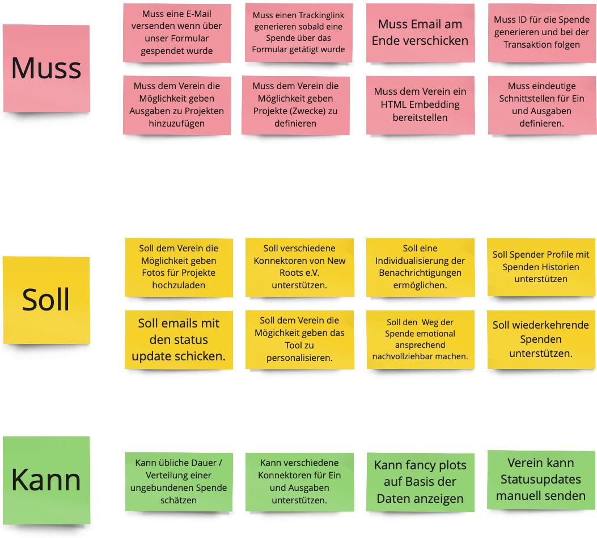
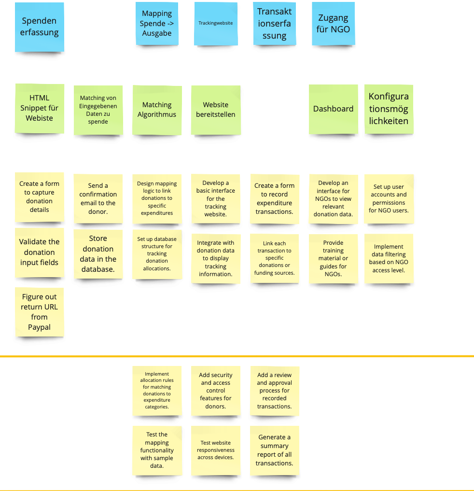
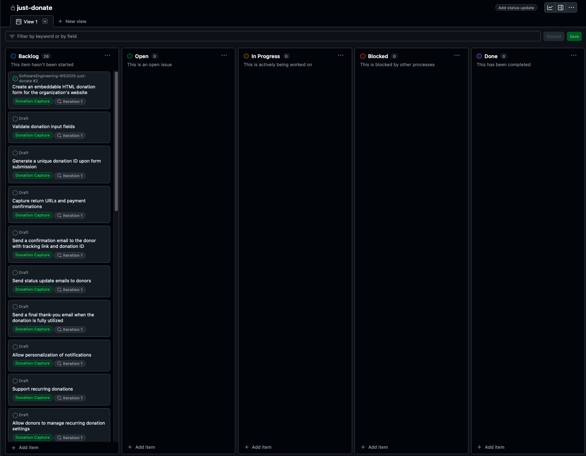
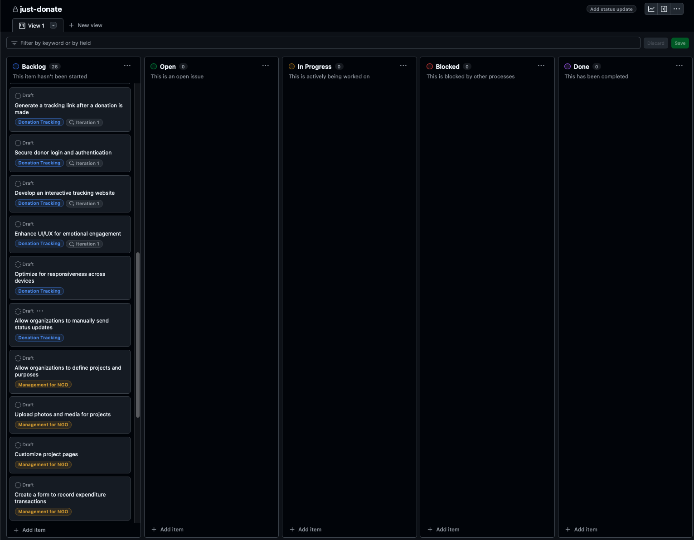
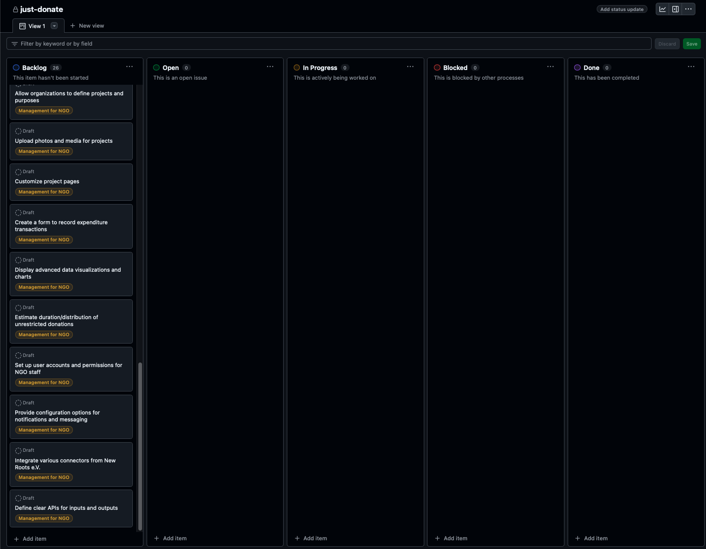

# Abgabe Blatt 05 - Team 03 Just Donate 

Lukas Brennauer, Gerrit Holzbaur, Anton Kluge, Jakob Limmer, Sarp Sahinalp

## 1 Domänenmodell

## 2 Architekturmodell 

## 3 Backlogeinträge 

### 3.0 Kann-/Soll-/Muss-Kriterien

[Miro Board](https://miro.com/app/board/uXjVLRFTGG0=/)

### 3.1 Story Mapping 

[Miro Board](https://miro.com/app/board/uXjVLRFTGG0=/)

### 3.2 Github Board

[Github Board](https://github.com/users/AntonKluge/projects/1)

