# Abgabe - Team 03 Just Donate 

## 0 Generelle Informationen

Teammitglieder (in alphabetischer Reihenfolge): 
- Lukas Brennauer
- Gerrit Holzbaur
- Anton Kluge
- Jakob Limmer
- Sarp Sahinalp

Das [Miro Board](https://miro.com/app/board/uXjVLRFTGG0=/) enthält zusätzliche Dokumente zum Design Thinking Prozess (insbesondere zu Bestimmung der Personas und der Ideenfindung). 

## 1 Mindmap

[Mindmap](https://github.com/just-donate/SoftwareEngineering-WS2025-just-donate/blob/main/submissions/final/01_Mindmap.png)

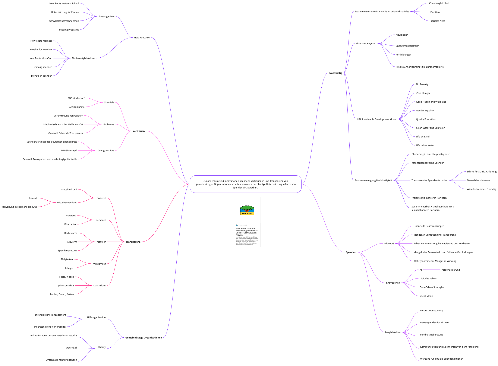

## 2 Glossar

[Glossar](https://github.com/just-donate/SoftwareEngineering-WS2025-just-donate/blob/main/submissions/final/02_Glossar.png)

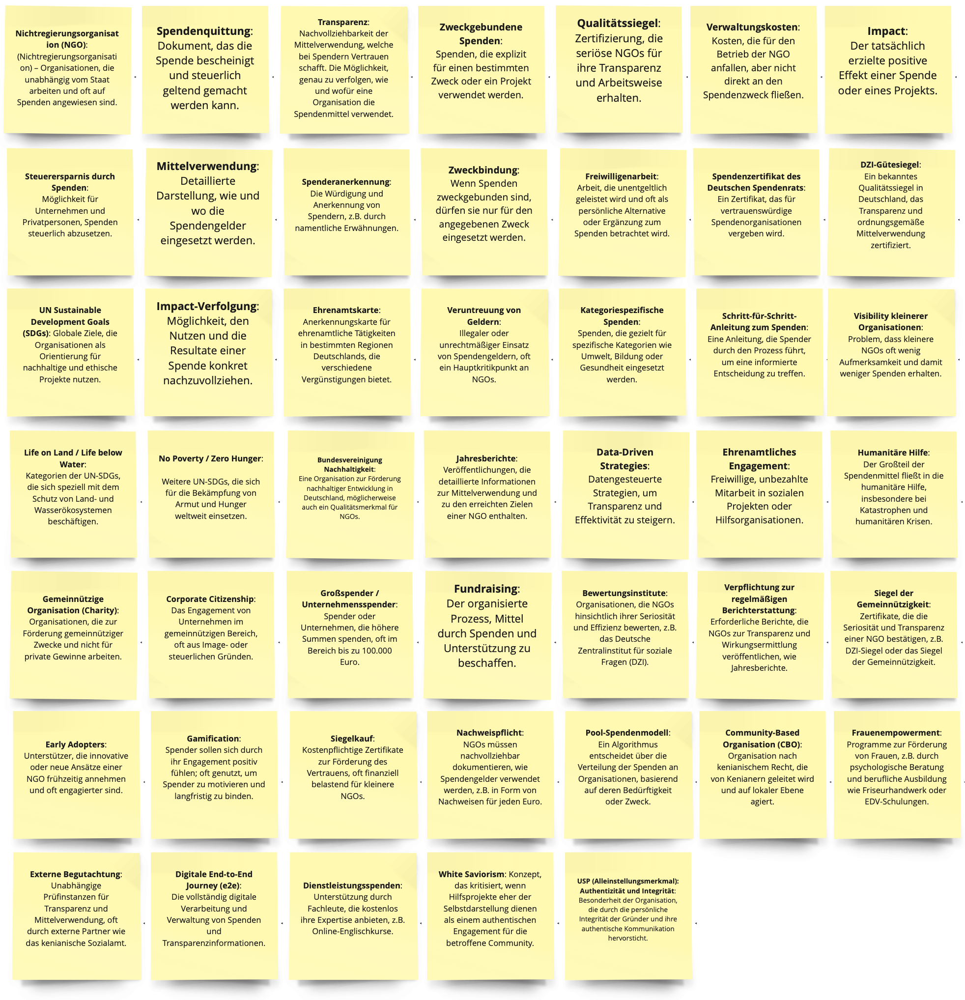

## 3 Personas 
### 3.1 Wolfgang Habicht

[Wolfgang Habicht](https://github.com/just-donate/SoftwareEngineering-WS2025-just-donate/blob/main/submissions/final/03_Personas/01_WolfgangHabicht.png)

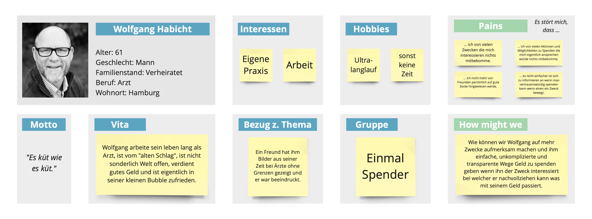

### 3.2 Elias Miet

[Elias Miet](https://github.com/just-donate/SoftwareEngineering-WS2025-just-donate/blob/main/submissions/final/03_Personas/02_EliasMiet.png)

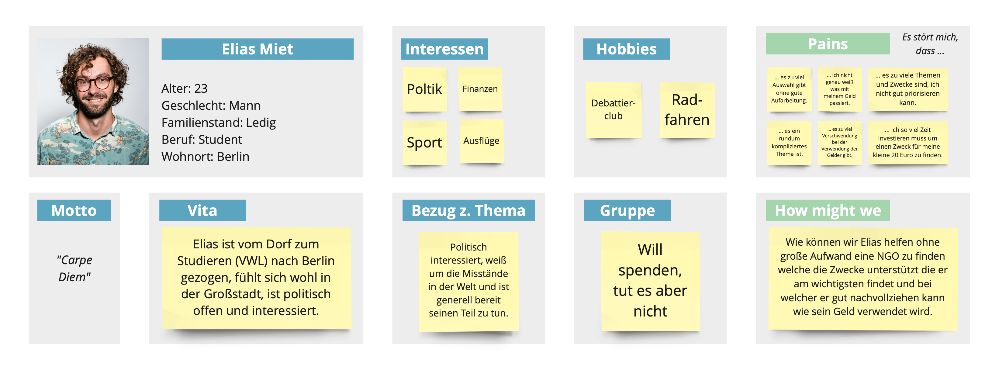

### 3.3 Karl Schmidt

[Karl Schmidt](https://github.com/just-donate/SoftwareEngineering-WS2025-just-donate/blob/main/submissions/final/03_Personas/03_KarlSchmidt.png)

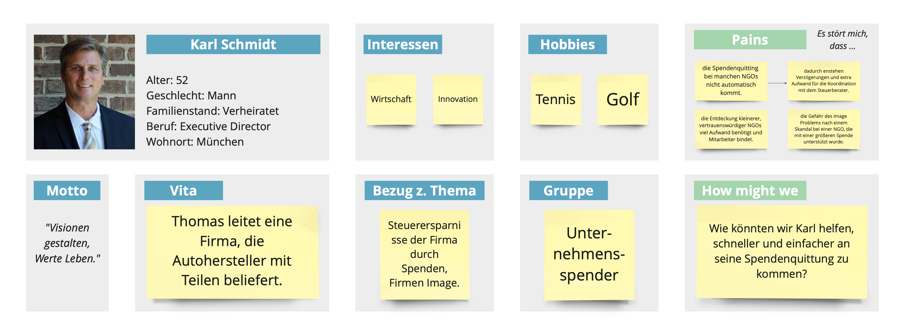

### 3.4 Laura Schneider

[Laura Schneider](https://github.com/just-donate/SoftwareEngineering-WS2025-just-donate/blob/main/submissions/final/03_Personas/04_LauraSchneider.png)

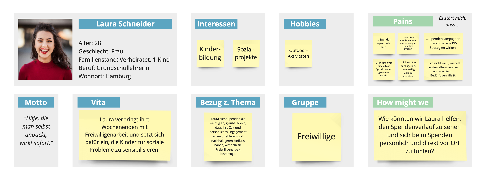

### 3.5 Adrian Haacks

[Adrian Haacks](https://github.com/just-donate/SoftwareEngineering-WS2025-just-donate/blob/main/submissions/final/03_Personas/05_AdrianHaacks.png)

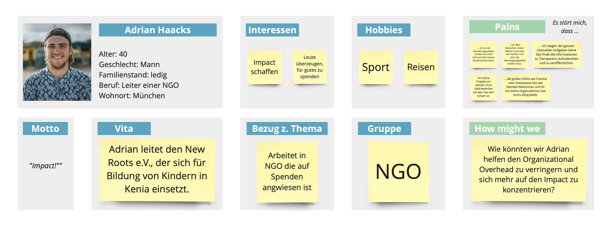

### 3.6 Sebastian Meier

[Sebastian Meier](https://github.com/just-donate/SoftwareEngineering-WS2025-just-donate/blob/main/submissions/final/03_Personas/06_SebastianMeier.png)

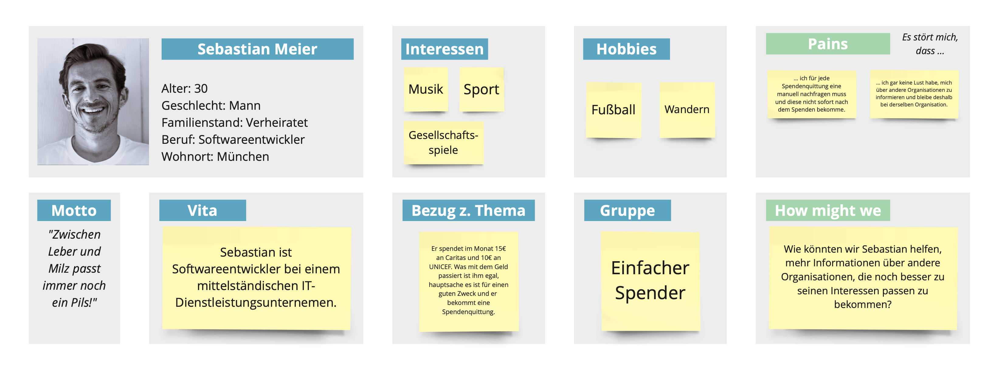

### 3.7 Roland Maiberg

[Roland Maiberg](https://github.com/just-donate/SoftwareEngineering-WS2025-just-donate/blob/main/submissions/final/03_Personas/07_RolandMaiberg.png)

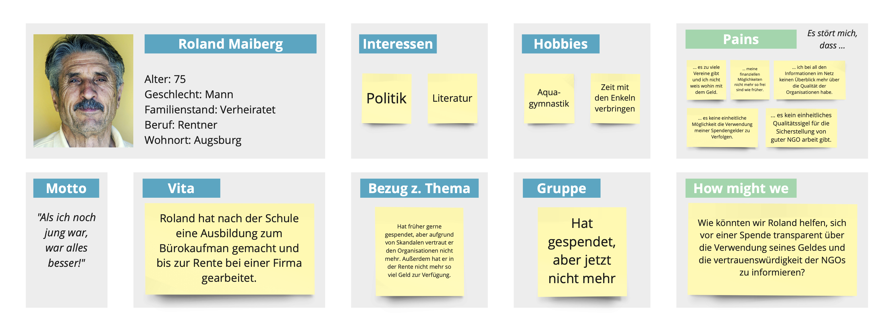

### 3.8 Manfred Herber

[Manfred Herber](https://github.com/just-donate/SoftwareEngineering-WS2025-just-donate/blob/main/submissions/final/03_Personas/08_ManfredHerber.png)

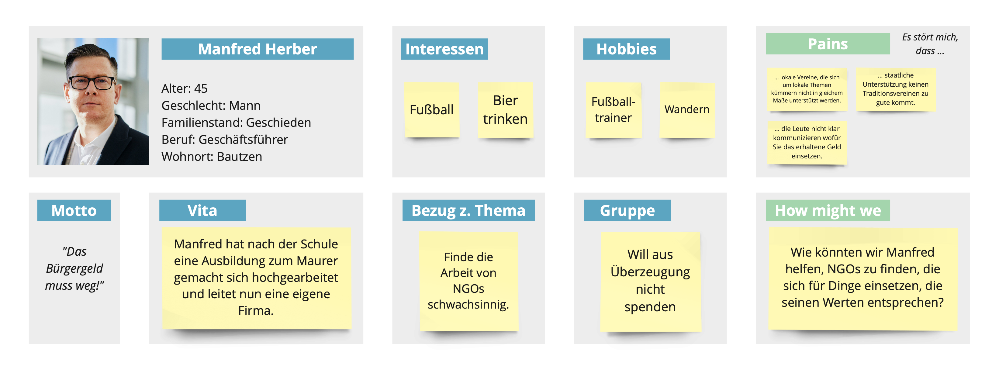

## 4 Domänenmodell 

[Domänenmodell](https://github.com/just-donate/SoftwareEngineering-WS2025-just-donate/blob/main/submissions/final/04_Domänenmodell.png)

## 5 Architekturmodell 

[Domänenmodell](https://github.com/just-donate/SoftwareEngineering-WS2025-just-donate/blob/main/submissions/final/05_Architekturmodell.png)

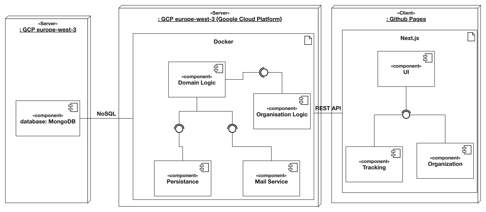

## 6 Projektplan 

- Erster Projektplan vor Repository Umzug: [https://github.com/users/AntonKluge/projects/1](https://github.com/users/AntonKluge/projects/1)
- Zweiter Projektplan nach Repository Umzug: [https://github.com/orgs/just-donate/projects/2](https://github.com/orgs/just-donate/projects/2)

## 7 Gesamter Quellcode 

Der gesamte Quellcode kann im GitHub Repository eingesehen werden. Eine ausführliche Beschreibung der einzelnen Module und der Verwendung ist in der [README](https://github.com/just-donate/SoftwareEngineering-WS2025-just-donate/blob/main/README.md) zu finden.

## 8 Deploymentpipeline 

Die gesamte Deploymentpipeline befindet sich im GitHub Repository. Eine ausführliche Beschreibung ist in der [README](https://github.com/just-donate/SoftwareEngineering-WS2025-just-donate/blob/main/README.md) zu finden. 

- [Backend CI](https://github.com/just-donate/SoftwareEngineering-WS2025-just-donate/actions/workflows/backend-ci.yml)
- [Frontend CI](https://github.com/just-donate/SoftwareEngineering-WS2025-just-donate/actions/workflows/frontend-ci.yml)
- [SonarCube CI](https://github.com/just-donate/SoftwareEngineering-WS2025-just-donate/actions/workflows/sonarqube-ci.yml)

Das Tool ist unter folgenden URL deployed: [https://just-donate.github.io/SoftwareEngineering-WS2025-just-donate/](https://just-donate.github.io/SoftwareEngineering-WS2025-just-donate/)

## 9 Abschlusspräsentation 

Die Abschlusspräsentation wurde per Mail versendet und im GitHub Repository hochgeladen. Sie kann [hier](https://github.com/just-donate/SoftwareEngineering-WS2025-just-donate/blob/main/submissions/final/09_Slides.pdf) aufgerufen werden. 

